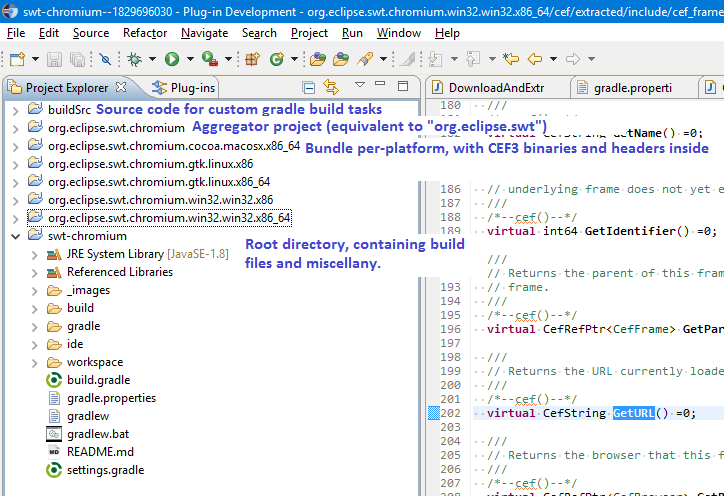

# Contributing to swt-chromium

We need help!!  Here's what we have so far:

- `gradlew ide` will give you an IDE with JDT, PDE, and CDT, which looks like this:



- For each platform, you need a CEF3 download (which is pretty big)
	+ about ~120MB download, extracts to ~400Mb
- `gradlew downloadCEF` will download and extract the CEF3 binaries and headers for your native platform only.
	+ `gradlew downloadCEF -Pplatforms=all` will download for all, or `-Pplatforms=win32.win32.x86,win32.win32.x86_64` if you want to list them out manually.
	+ To change the CEF version, take a look at [`gradle.properties`](gradle.properties).
- And that's as far as we are :)  You've got projects with the SWT binaries and the CEF binaries, but there's no glue in between yet.  It's on its way!

## License

By contributing your code, you agree to license your contribution under the terms of the EPL v1.0: http://www.eclipse.org/legal/epl-v10.html

```
/*****************************************************************
 * Copyright (c) 2012, 2013 Texas Instruments and others
 * All rights reserved. This program and the accompanying materials
 * are made available under the terms of the Eclipse Public License v1.0
 * which accompanies this distribution, and is available at
 * http://www.eclipse.org/legal/epl-v10.html
 *
 * Contributors:
 *     Patrick Chuong (Texas Instruments) - Initial API and implementation
 *****************************************************************/
```
